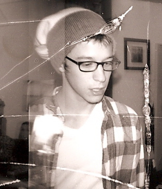

<body>

    

        

            <h2>about</h2>
            

                

                    
                

                

                    
                

                

                

                    Hi! My name is Dan. 
                

                

                    I've been asking questions about how things work since 1988. This site has been a long time coming and is the latest iteration of a curious mind.
                

                

                    Currently, I'm an analyst and editor for the digital archives product line at EBSCO Information Services. For the past two years, I've been part of a team that has produced over sixty archival collections. My interests lay in digitization, data visualizations, textual analysis, information retrieval, digital preservation and digital history. When I'm not mucking around on my computer, I get overly excited about historiography,  20th-century American history, and riding a snowboard. 
                

                

                    I graduated from the College of the Holy Cross and since then have worked on a farm in Central Massachusetts, a mountain in Colorado, and as a community organizer. I'm currently based out of Somerville, MA.
                
  
                

            

            
                
        

    

    

        

            <h2>cv</h2>
            

                

                    <h3>Selected Experience</h3>
                        <ul>
                            <li>Product Management Analyst, EBSCO Information Services, 2014 - Present</li>
                            <li>Assistant Database Editor, EBSCO Information Services, 2012 - 2014</li>
                            <li>Community Organizing Apprentice, AmeriCorps VISTA, 2012 - 2012</li>
                            <li>Snowboard Technician, Christy Sports, 2011-2012</li> 
                            <li>General Laborer, Tougas Family Farm, 2011-2011</li>
                            <li>Writer's Workshop Tutor, College of the Holy Cross 2010-2011</li>
                            <li>Teaching Assistant, Elements of Writing Argument, College of the Holy Cross, 2010-2010</li>      
                        </ul>
                

                

                    <h3>Education</h3>
                        

                            B.A. in History with a concentration in Russian and Eastern European Studies, <i>College of the Holy Cross </i>, 2011, Phi Alpha Theta
                        

                        </ul>
                    <h3>Skills</h3>
                        <ul>
                            <li>Python, JavaScript, R, Git</li>
                            <li>MySQL, MS Access</li>
                            <li>WordPress, HTML, CSS, XML</li>
                        </ul>
                

            

                    
        

    
 
</body>